# MCP Tool Server Pattern

## Introduction

You have a backend service — a code search engine, a document store, a log query API, or other collection of API services — running locally or behind a REST API. It works, but AI agents can't use it directly. Agents need a **standardized tool interface** with typed inputs/outputs, structured errors, and pagination support.

**This repository shows you how to wrap an existing backend service as an [MCP](https://modelcontextprotocol.io/) (Model Context Protocol) tool server** — a thin protocol adapter that gives agents structured access to your backend through standardized tool contracts. The same server runs **locally** (stdio, no auth, for development) and **in the cloud** (HTTP, with authentication, for production).

## The Challenges

Wrapping a backend service as an agent-facing tool server is not just "add an API layer." Several design problems must be solved:

| Challenge | What Goes Wrong Without It |
|-----------|--------------------------|
| **Pagination** | Search returns thousands of results. Without cursor-based pagination with server-side state, agents either get truncated results or blow up context windows. |
| **Authentication** | Locally, no auth is needed. In the cloud, agents authenticate via OAuth2, and the server authenticates to the backend via cloud-native credentials. These are two separate auth layers. |
| **Input validation** | Agents generate tool calls from LLM output — malformed queries, missing fields, invalid types. Without validation at the tool boundary, bad inputs propagate to the backend. |
| **Error handling** | Backend returns HTTP 503. The agent needs a structured MCP error code with a request ID, not a raw HTTP response. Without structured error mapping, agents can't reason about failures. |
| **Dual-mode transport** | Developers test locally via stdio; production uses HTTP+SSE. The tool logic must be identical in both modes — otherwise you get "works locally, breaks in production." |
| **Data transfer** | Large files/results must be sliced. Without content slicing (line ranges, page ranges), a single retrieval call can return megabytes that exceed agent context limits. |

This repository provides **design patterns, tool contract templates, and architecture guidance** for solving these challenges.

## What This Repository Contains

This is a **design reference**, not a runnable codebase. It includes:

- **Architecture documentation** — three-layer MCP server design (Tool Layer → Request Translation → Error Handling), data flow, and deployment modes
- **Tool contract templates** — parameterized YAML schemas for search-domain and retrieval-domain tools, with pagination, error codes, and slicing
- **Design principles** — engineering rationale for thin servers, dual-mode transport, and pagination strategies

## Repository Structure

```
MCP-tool-server-pattern/
  README.md                             <- You are here
  LICENSE                               <- Apache License 2.0
  NOTICE                                <- Copyright notice
  docs/
    architecture.md                     <- MCP server architecture, data flow, deployment modes
    design-principles.md                <- Engineering rationale and trade-off analysis
  schemas/
    search-tool-template.yaml           <- MCP tool template: search-domain tools
    retrieval-tool-template.yaml        <- MCP tool template: retrieval-domain tools
  assets/
    architecture-overview.svg           <- High-level architecture diagram (rendered)
    architecture-overview.mmd           <- Mermaid source for the diagram
```

## Architecture Overview



> Diagram source: [`assets/architecture-overview.mmd`](assets/architecture-overview.mmd) (Mermaid)

## Concrete Example: Wrapping a Code Search Engine

To make the pattern concrete, here's how it applies to wrapping a code search engine (e.g., Zoekt, Elasticsearch) as an MCP tool server:

| Layer | What It Does | Example |
|-------|-------------|---------|
| **Backend** | Runs the search engine, indexes code, serves REST API | Zoekt indexes 500 repos, exposes `/search` and `/list` endpoints |
| **MCP Tool Layer** | Defines typed tool contracts agents can call | `search` tool: takes `query`, `repo_id`, `max_results`, `cursor` → returns ranked results with `next_cursor` |
| **Request Translation** | Converts MCP tool call to HTTP request | `search("func main", repo_id="my-repo")` → `POST /search {"query": "func main", "repos": ["my-repo"]}` |
| **Error Handling** | Maps backend HTTP errors to MCP error codes | HTTP 404 → `NOT_FOUND` (-32001); HTTP 503 → `BACKEND_UNAVAILABLE` (-32002) |
| **Pagination** | Manages server-side cursor state | First call returns 50 results + `cursor="abc123"`. Next call with `cursor="abc123"` returns next 50. Cursor expires after 15 min (TTL). |

**Local mode**: Developer runs `mcp-server --stdio`, connects from IDE. No auth. Backend runs on localhost.

**Cloud mode**: Server runs as HTTP+SSE behind an API gateway. Agent authenticates via OAuth2 at the gateway. Server authenticates to backend via cloud-native credentials.

| Deployment | Transport | Agent → Server Auth | Server → Backend Auth |
|-----------|-----------|-------------------|---------------------|
| Local (stdio) | stdin/stdout JSON-RPC | None (local trust) | None (localhost) |
| Cloud (HTTP) | HTTP + SSE | OAuth2 at gateway (AWS: Cognito / Azure: Entra ID) | Cloud-native (AWS: IAM SigV4 / Azure: Managed Identity) |

## Artifact Index

| Artifact | Type | Description |
|----------|------|-------------|
| [Architecture](docs/architecture.md) | Documentation | MCP server internal layers, data flow, deployment modes |
| [Design Principles](docs/design-principles.md) | Documentation | Engineering rationale, trade-off analysis, extensibility guide |
| [Search Tool Template](schemas/search-tool-template.yaml) | Schema | Parameterized MCP tool template for search-domain tools |
| [Retrieval Tool Template](schemas/retrieval-tool-template.yaml) | Schema | Parameterized MCP tool template for retrieval-domain tools |

## Pattern Summary

A single MCP server exposes multiple **tool categories**, each addressing a different data access pattern:

| Tool Category | Tool Pattern | Pagination | Example Backend |
|---------------|-------------|------------|-----------------|
| Search-domain tools | Discovery → search → retrieval | Cursor-based (server-side state, TTL) | Zoekt, Elasticsearch, Sourcegraph |
| Retrieval-domain tools | List → search metadata → retrieve | Offset-based (stateless) | Document stores, wikis, runbooks |

## How to Use This Reference

1. **Start with the architecture** — Read [`docs/architecture.md`](docs/architecture.md) to understand the three-layer server design and data flow.
2. **Review the design principles** — [`docs/design-principles.md`](docs/design-principles.md) explains the trade-offs behind pagination, auth, and thin server design.
3. **Adapt the tool templates** — The YAML templates under `schemas/` define parameterized tool contracts with `{{placeholders}}`. Fork these and fill in domain-specific values.
4. **Extend with new tool categories** — See the "Extensibility" section in [Design Principles](docs/design-principles.md) for guidance on adding new tool categories.

## Related Work

For guidance on deploying the MCP server and its backend as cloud-native infrastructure (containerization, serverless compute, managed storage, multi-cloud mapping), see the companion project **[MCP-tool-deployment-pattern](../MCP-tool-deployment-pattern/)**.

## De-identification Notice

This repository contains **generalized design patterns and tool contract templates** informed by experience in industrial environments. All employer-specific system names, internal URLs, proprietary configurations, and sensitive operational data have been removed. The patterns demonstrated here are applicable to any organization building MCP tool servers.

## License

Apache License 2.0. See [LICENSE](LICENSE).
